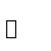
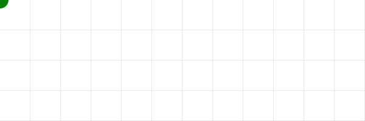

# Hi there!   
I am Riccardo Pivi an Italian🤌 **Physics student** at the University of Bologna (Unibo) 📚, where I dive into the wonders of the universe, from the smallest particles to the vast cosmos. I live in **Forlì, Romagna** 🐓.

# 🌱 My Interests
- **Curiosity-Driven**: I'm always eager to learn new things and explore the unknown.
- **Physics & Beyond**: My main focus is physics, but I'm fascinated by related fields like statistics and machine learning. I also love poetry.

# 🛠️ Skills
- **C++ Programming**: Experience in developing simulations.
- **Python Programming** : I like Data Science and simulation.
- **Latex**: Experience in writing laboratory and simulation reports.
  
# 📬 Get in touch

  
