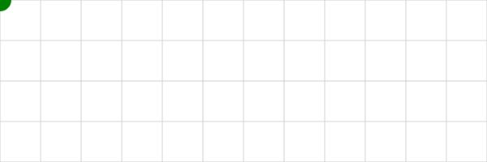

# Hi there!   

# 🧑‍🎓 About Me
I am Riccardo Pivi an Italian🤌 **Physics student** at the University of Bologna (Unibo) 📚, where I dive into the wonders of the universe, from the smallest particles to the vast cosmos. I live in **Forlì, Romagna** 🐓.

# 🌱 My Interests
- **Curiosity-Driven**: I'm always eager to learn new things and explore the unknown.
- **Physics & Beyond**: My main focus is physics, but I'm fascinated by related fields. I also like poetry and literature.

# 🛠️ Skills
- **C++ Programming**: Experience in developing simulations, and scientific computations.
  

  
<!--
**rpivi/rpivi** is a ✨ _special_ ✨ repository because its `README.md` (this file) appears on your GitHub profile.
-->
